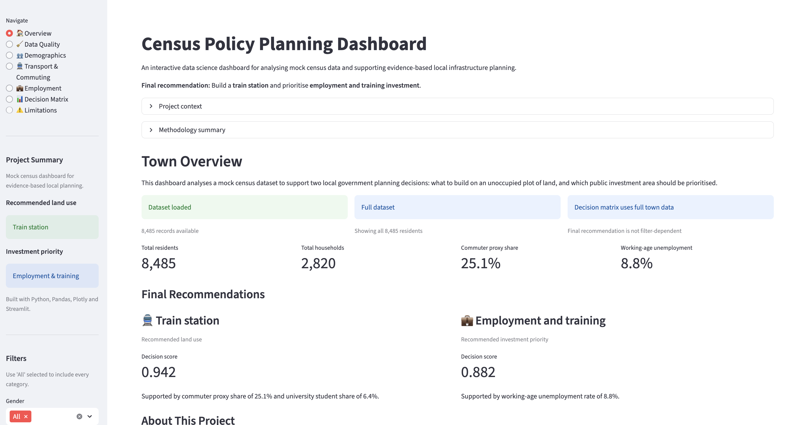

# Census-Based Policy Planning Analysis

## Live Dashboard

View the interactive dashboard here: [Census Policy Planning Dashboard](https://census-policy-planning-analysis.streamlit.app/)

## Overview

This project uses a mock census dataset for an imaginary UK town to support local government decision-making. The dataset contains demographic and household information such as age, gender, marital status, occupation, religion, infirmity, household relationships, and address details.

The first stage of the project is to clean the dataset by handling missing values, inconsistent categories, invalid entries and duplicate records. The cleaned data is then analysed to understand the town’s population structure, employment patterns, household composition, commuting behaviour, religious affiliation, age distribution and infrastructure needs.

The main objective is to use statistical evidence from the census data to make two policy recommendations:
1. What should be built on an unoccupied plot of land.
2. Which public investment area should be prioritised.

Possible land-use options include housing, a train station, a second religious building, or an emergency medical facility. Possible investment priorities include employment and training, old-age care, schooling, or general infrastructure. The final recommendations must be justified using evidence from the cleaned dataset, supported by descriptive statistics, visualisations, and where appropriate, hypothesis testing.

## Tools Used
- Python
- Pandas
- NumPy
- Matplotlib
- Seaborn
- Jupyter Notebook

## Key Skills Demonstrated
- Data cleaning and imputation
- Exploratory data analysis
- Demographic segmentation
- Public-policy-style recommendation
- Data visualisation
- Evidence-based decision-making

## Analysis Performed
- Missing value assessment
- Age distribution and population pyramid
- Household occupancy analysis
- Unemployment rate analysis
- Religious affiliation analysis
- Commuter proxy analysis using university students and likely commuter occupations
- Birth and ageing indicators

## Key Findings
- The town has a strong working-age population, a notable student presence and measurable unemployment among working-age residents. Household composition suggests demand for accessible housing, while high missingness in religion and limited health-service variables mean religious and medical infrastructure recommendations should be treated cautiously.

## Final Recommendation
- Recommended land use: Train station
- Recommended investment area: Employment and training

## Repository Structure
```
census-policy-planning-analysis/
│
├── README.md
│
├── data/
│   ├── raw/
│   │   └── mock_census.csv
│   └── processed/
│       └── cleaned_census.csv
│
├── notebook/
│   └── census-policy-planning-analysis.ipynb
│
├── outputs/
│   ├── figures/
│   │   ├── adult_marital_status_distribution.png
│   │   ├── dashboard_overview.png
│   │   ├── commuter_demand_indicators.png
│   │   ├── household_occupancy_distribution.png
│   │   ├── investment_decision_matrix_scores.png
│   │   ├── land_use_decision_matrix_scores.png
│   │   ├── population_distribution_by_age_group.png
│   │   ├── population_pyramid_by_gender.png 
│   │   ├── public_service_pressure_indicators.png
│   │   ├── religious_affiliation_distribution.png
│   │   └── unemployment_rate_by_age_group.png
│   └── summary_tables/
│       ├── age_distribution.csv
│       ├── commuter_summary.csv
│       ├── data_quality_summary.csv
│       ├── household_occupancy_summary.csv
│       ├── initial_data_quality_audit.csv
│       ├── investment_decision_matrix.csv
│       ├── kpi_summary.csv
│       ├── land_use_decision_matrix.csv
│       ├── marital_status_summary.csv
│       ├── post_clean_data_quality_audit.csv
│       ├── religion_summary.csv
│       ├── service_pressure_indicators.csv
│       ├── unemployment_by_age_group.csv
│       └── unemployment_chi_square_test.csv
└── reports/
    ├── assumptions.csv
    ├── limitations.csv
    └── recommendation_summary.csv
```
## Interactive Streamlit Dashboard

This project includes an interactive Streamlit dashboard that allows users to explore the mock census dataset and review the evidence behind the final policy recommendations.

The dashboard includes:

- data quality checks and missing-value analysis
- cleaned dataset preview
- demographic analysis by age group and gender
- transport and commuting indicators
- employment and training indicators
- transparent decision matrices for land-use and investment options
- limitations, assumptions and additional data requirements
- downloadable cleaned dataset and decision matrix outputs

### Final Recommendations

Based on the available census indicators, the dashboard recommends:

| Decision Area | Recommendation | Main Evidence |
|---|---|---|
| Land use | Train station | High commuter-proxy share and university-student population |
| Investment priority | Employment and training | Working-age unemployment signal |

The decision matrix is based on the full dataset and represents the whole town, not a filtered subgroup.

## How to Run the Dashboard Locally

Install the required packages:

```
pip install -r requirements.txt
```

Run the Streamlit app:
``` 
streamlit run app.py
```

The dashboard should open automatically in your browser. If it does not, open the local URL shown in the terminal.

## Dashboard Preview



The screenshot above shows the Streamlit dashboard overview page, including the final recommendations, project summary and policy indicators.
